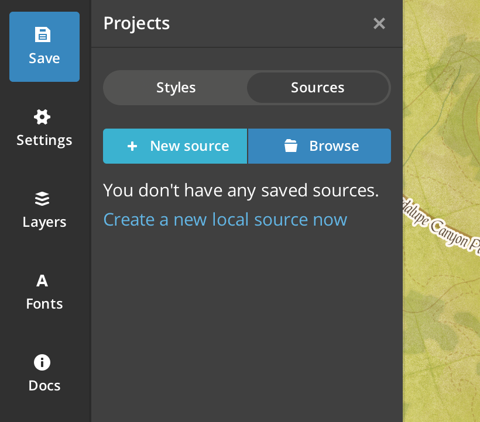
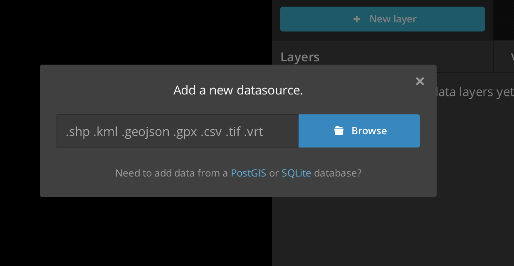
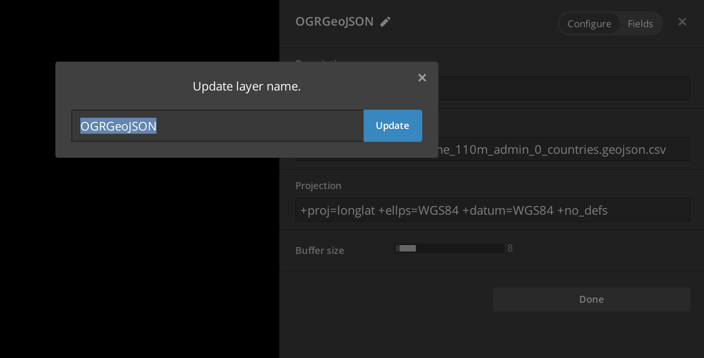
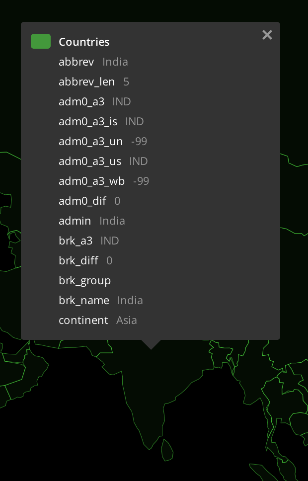
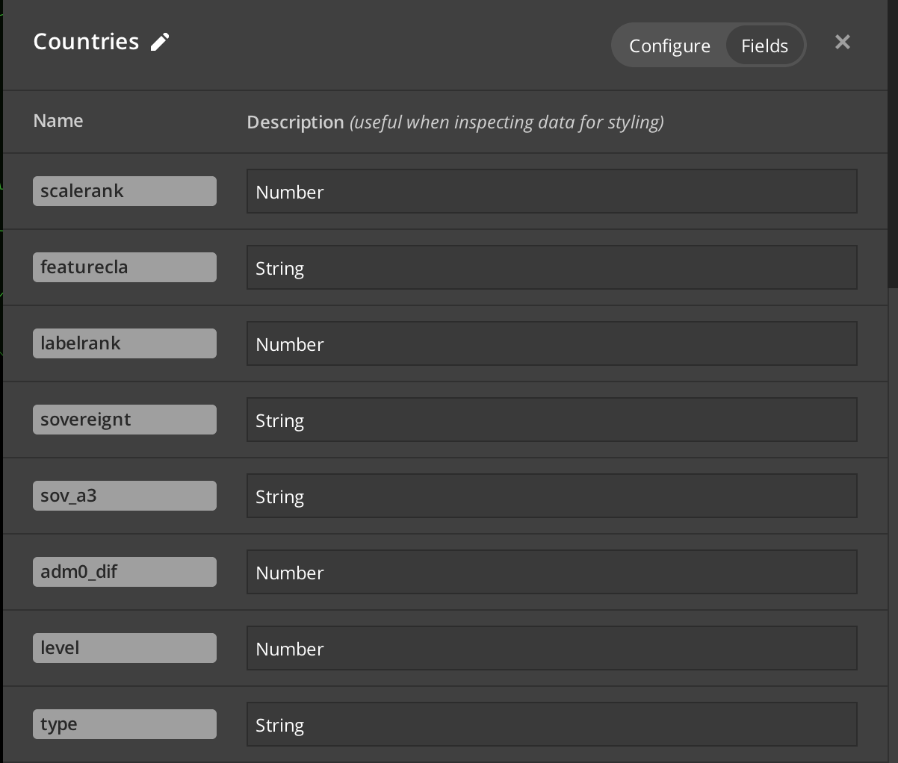
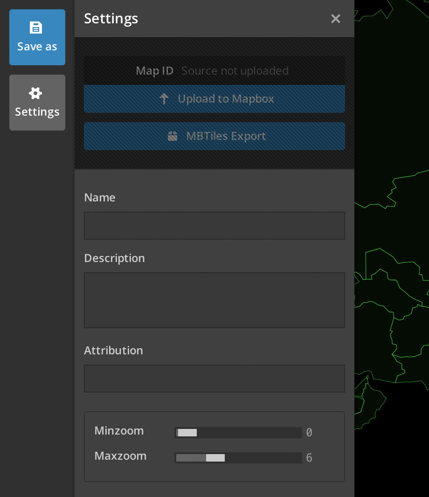
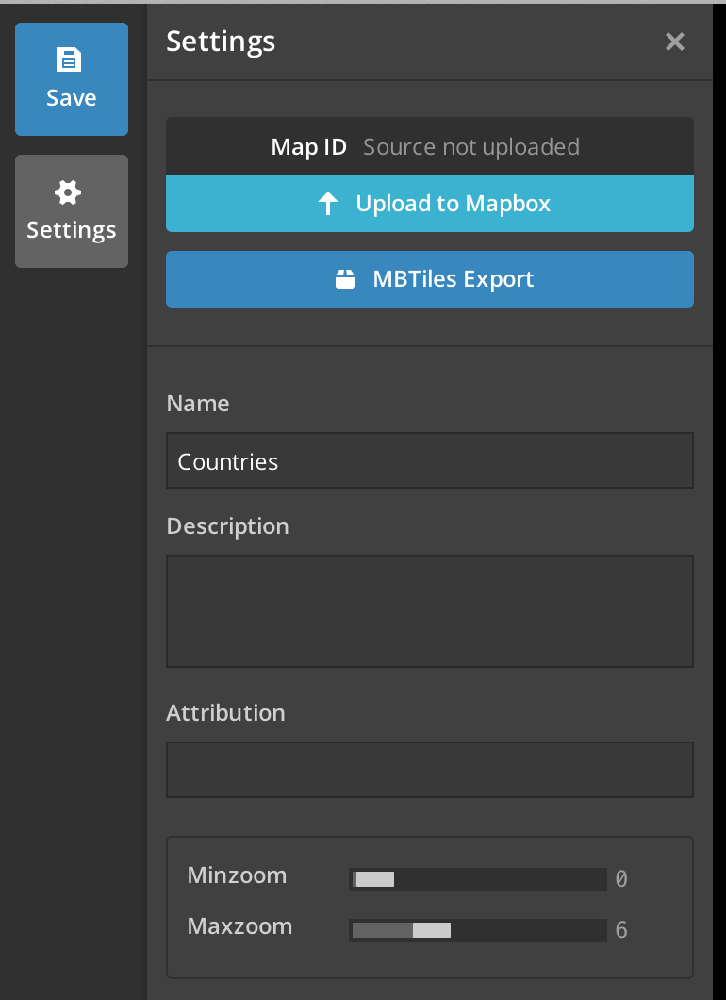
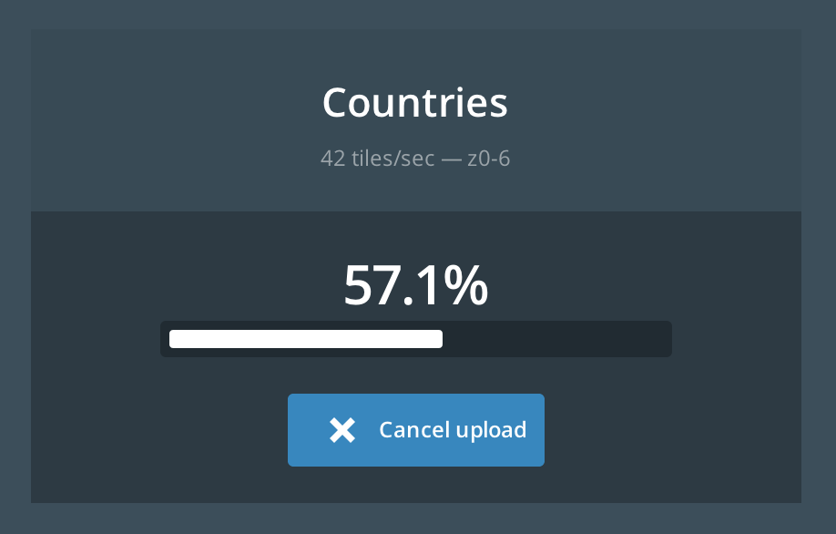
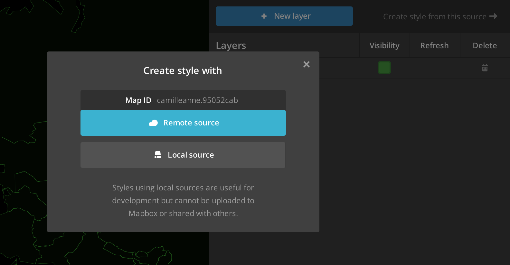

Create a source: importing a spreadsheet
=======================

Unlike TileMill, Mapbox Studio cannot apply visual styles to geospatial data files directly. Instead, the raw data must be collected and cut into [Mapnik Vector Tiles](./HOWTO-introduction.md#what-are-vector-tiles). Mapbox Studio source projects transform [traditional geodata formats](./HOWTO-sources.md#supported-formats) into vector tiles containing the appropriate layers and configurations needed for styling.

There is no visual style directly associated with sources - the source view of Mapbox Studio autogenerates an inspection style only for viewing your data. We'll continue on to [Quick start: Styles](./HOWTO-quickstyles.md) to learn about applying styles to vector tile sources.

One of the [many geo formats](/tilemill/docs/manual/adding-layers/) that Mapbox Studio supports is a spreadsheet, specifically a [comma-separated values (CSV) file](http://en.wikipedia.org/wiki/Comma-separated_values). We want to start by working with a basic spreadsheet to show how easy it is to make a simple world map.

Quick Tutorial
--------------

### Your CSV spreadsheet
<small class='note' markdown='1'>
__Tip:__ Want to import a spreadsheet directly to Mapbox.com? See <a href='https://www.mapbox.com/help/import-features/'>the documentation for import CSV &amp; other types of files directly into the editor</a>.
</small>

To import data into Mapbox Studio as a CSV file you need column headings on the first row. The CSV must also contain columns with latitude and longitude geographic coordinates. We have hard coded Mapbox Studio to look at the column headers for any mention of "lat" or "latitude", so something like "geo_longitude" will even work. 

If your CSV contains place names or addresses instead of lat/lon coordinates, you will have to geocode the data before it will work in Mapbox Studio. We have a [plugin for Google Docs](http://developmentseed.org/blog/2011/10/12/mapping-google-doc-spreadsheet/) that makes geocoding easy. ****

In this crash course, we'll use this GeoJSON file of country polygons from Natural Earth: [ne_110m_admin_0_countries.geojson](https://raw.githubusercontent.com/nvkelso/natural-earth-vector/master/geojson/ne_110m_admin_0_countries.geojson) (right-click and "Save link as")

### Create a new project

Open Mapbox Studio and click on __Projects__ in the lower left - this will open up a listing of your projects. Switch the toggle at the top-right of the listing from __Styles__ to __Sources__, then click the __New Source__ button at the top.

### Adding your first layer

1. Now click the __New Layer__ button in Mapbox Studio. To point the layer at the correct file, click the __Browse__ button and use the file browser to find and select `ne_110m_admin_0_countries.geojson`.

	

2. In the right panel you'll see the configuration view for your newly-added layer. The name of the layer will autofill with metadata from the file. Edit the layer name by clicking the pencil icon next to the name and update it with a name like `countries`.

	

3. Verify that projection is set correctly. This field will also autofill with metadata from the file, and it should reference WGS84.

	

	_Currently Mapbox Studio only accepts input files in either WGS84 (aka EPSG:4326) or 900913 (aka EPSG:3857). If you have data in other projections, you should reproject it to 900913 before adding it as a layer._

3. Click __Done__ to see your new layer. It is automatically given a color and style in the data preview.

### Inspect your data properties

4. Click on any element on the map in the preview pane to inspect the data fields and values within your layers. The layer name and color are shown so you can inspect multiple layers if features overlap. You will use these data fields to style this source.

	

5. You can also view the data fields for a layer when in the configuration view for a layer by switching the toggle in the upper left corner from __Configure__ to __Fields__.

	

### Project settings & saving

6. Click on the __Settings__ button to bring up the project settings panel. Here you can set information about your project as a whole, such as a name, description, and attributing your data sources. Change the name of the project to 'Countries' so when it's uploaded you will be able to find it.

	If you wish you can leave the other project settings as they are and come back to adjust them at any time.

	

7. Save your project. Click the __Save As__ button at the top of the window, or use the keyboard shortcut `Control+S` (`Command+S` on Mac OS X).

	Mapbox Studio source projects are saved as a directory of files with a suffix of `.tm2source` automatically appended to the name.

### Uploading & Exporting

8. Upload your project by click on the __Settings__ button, then __Upload to Mapbox__. If the source has already been uploaded to Mapbox, it's Map ID will be displayed. Uploading will update the source associated with that Map ID. Uploading a Mapbox Studio source project to Mapbox.com will allow you to use the source for Mapbox Studio style projects. 

	
	
	

	Exporting a Mapbox Studio source project will give you an [MBTiles]() file containing vector tiles. To export, click on the __Settings__ button, then __MBTiles Export__ near the top of the popup.

	Upload and export times can vary widely depending on your data and desired number of zoom levels - anywhere from a few minutes to many hours.

### Create Style From Source
9. Now that your source is saved, you can create a style from the source data by clicking __Create style from this source__. This will render an basic stylesheet based on the data layers and their fields.

	

	Local sources will not work in packaged & uploaded styles. Make sure to upload your source project and change the source reference in your style project before you publish the style.
	
Continue the crash course: